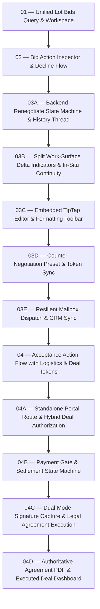

# Bid & Offer Management Track

Implementation track for Bid & Offer Management and [ADR 0035: Buyer Deal Settlement Portal, Payment Gate & E-Sign Agreement Flow](./0035-buyer-deal-settlement-portal-and-payment-gated-esign.md).

## Ticket Dependency Graph

## Track Documents & Specifications

- **Design Decision**: [ADR 0035: Buyer Deal Settlement Portal, Payment Gate & E-Sign Agreement Flow](./0035-buyer-deal-settlement-portal-and-payment-gated-esign.md)
- **Domain Model**: [Domain Glossary in CONTEXT.md](../../CONTEXT.md#bid--offer-management)

## Tickets

- [x] [01 — Unified Lot Bids Query & Workspace View](./issues/01-unified-lot-bids-query-and-workspace.md)
- [x] [02 — Bid Action Inspector & Decline Flow](./issues/02-bid-action-inspector-and-decline-flow.md)
- [x] [03A — Backend Renegotiate State Machine & History Thread](./issues/03a-backend-renegotiate-state-machine-and-history-thread.md)
- [x] [03B — Split Work-Surface Delta Indicators & In-Situ Continuity](./issues/03b-split-work-surface-delta-indicators-and-insitu-continuity.md)
- [x] [03C — Embedded TipTap Editor & Formatting Toolbar](./issues/03c-embedded-tiptap-editor-and-formatting-toolbar.md)
- [x] [03D — Counter Negotiation Preset & Dynamic Token Sync](./issues/03d-counter-negotiation-preset-and-token-sync.md)
- [x] [03E — Resilient Google OAuth Mailbox Dispatch & Lot CRM Sync](./issues/03e-resilient-mailbox-dispatch-crm-and-emailshub-sync.md)
- [x] [04 — Acceptance Action Flow with Logistics & Deal Tokens](./issues/04-acceptance-action-and-settlement-email.md)
  - [x] [04A — Standalone Portal Route & Hybrid Deal Authorization](./issues/04a-standalone-portal-route-and-hybrid-deal-authorization.md)
  - [x] [04B — Payment Gate & Settlement State Machine](./issues/04b-payment-gate-and-settlement-state-machine.md)
  - [x] [04C — Dual-Mode Signature Capture & Legal Agreement Execution](./issues/04c-dual-mode-signature-capture-and-legal-agreement-execution.md)
  - [x] [04D — Authoritative Agreement PDF Generation & Executed Deal Dashboard](./issues/04d-authoritative-agreement-pdf-and-executed-deal-dashboard.md)
- [x] [05 — Buyer Deal Settlement Portal with Payment Gate & E-Sign Agreement](./issues/05-deal-settlement-portal-and-esign.md) *(Feature milestone broken down into tracer bullets 04A–04D above)*

