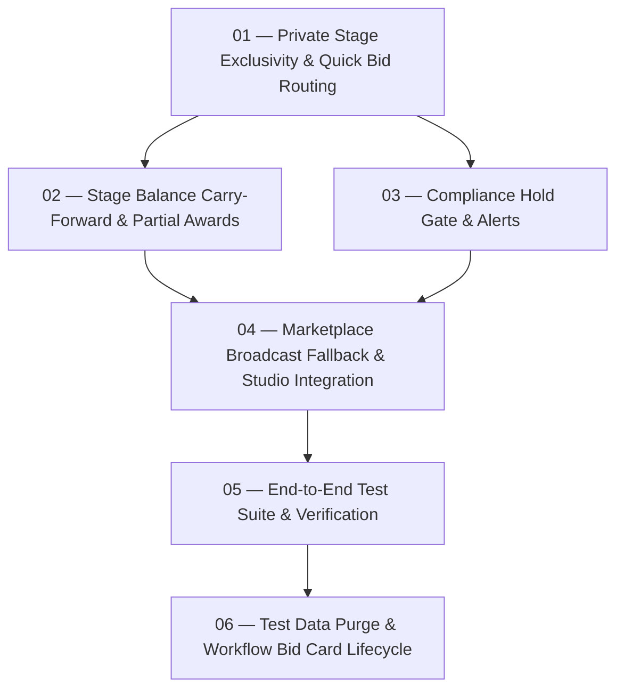

# Marketplace Broadcast & Private Stage Exclusivity

Implementation track for [ADR 0034: Private Stage Exclusivity & Marketplace Broadcast Policy](../../docs/adr/0034-private-stage-exclusivity-and-marketplace-broadcast-policy.md).

## Ticket Dependency Graph

## Tickets

- [x] [01 — Private Stage Exclusivity Enforcement & Quick Bid Routing](./issues/01-private-stage-exclusivity-and-quick-bid-routing.md)
- [x] [02 — Stage Balance Carry-Forward & Partial Awards Handling](./issues/02-stage-balance-carry-forward-and-partial-awards.md)
- [x] [03 — Compliance Hold Gate & Supplier Document Alerts](./issues/03-compliance-hold-gate-and-supplier-alert.md)
- [x] [04 — Marketplace Broadcast Fallback & Studio Integration](./issues/04-marketplace-broadcast-fallback-and-studio-integration.md)
- [x] [05 — End-to-End Test Suite & Policy Verification](./issues/05-end-to-end-verification-and-test-suite.md)
- [x] [06 — Marketplace Test Data Purge & Workflow Bid Card Lifecycle](./issues/06-marketplace-test-data-purge-and-workflow-bid-card-lifecycle.md)

